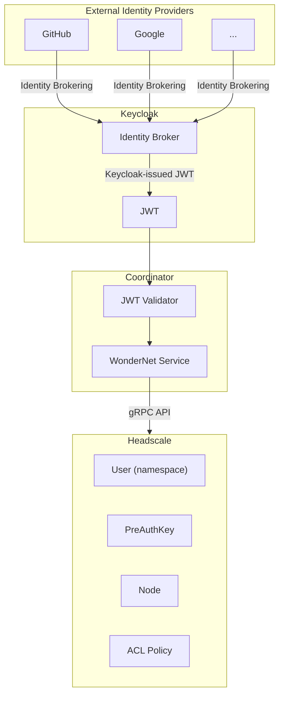
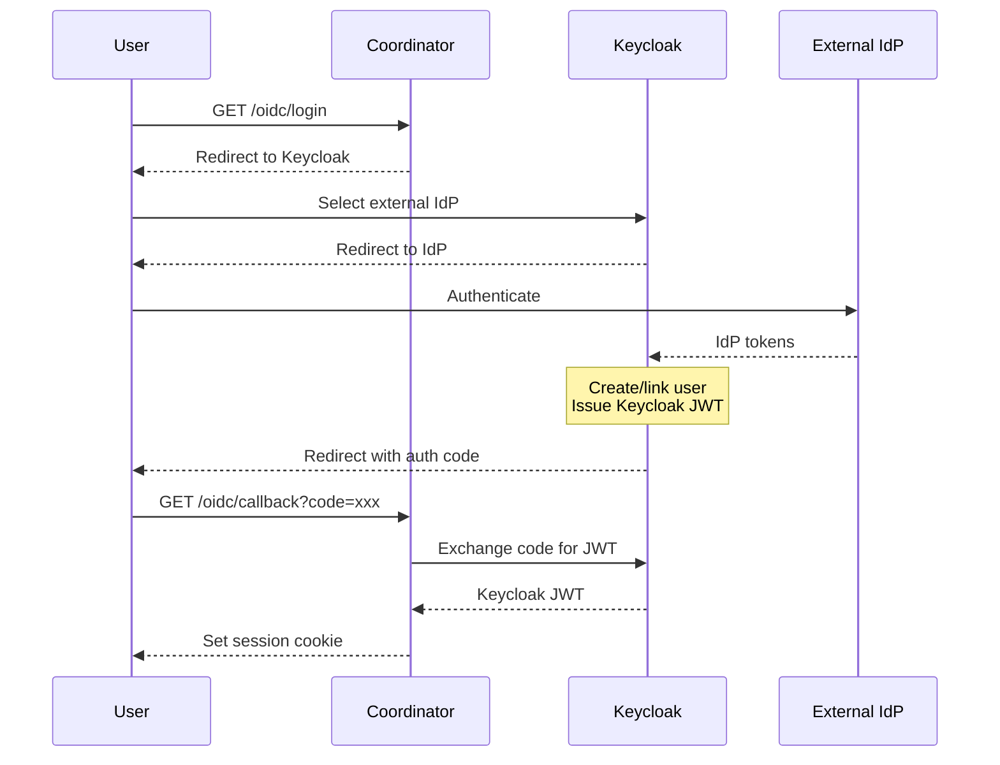
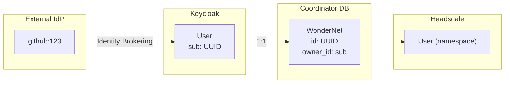
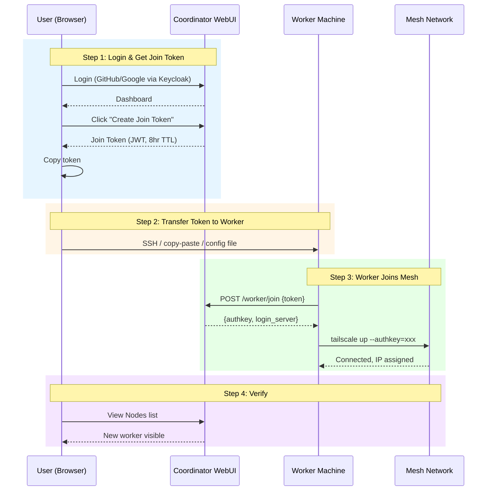
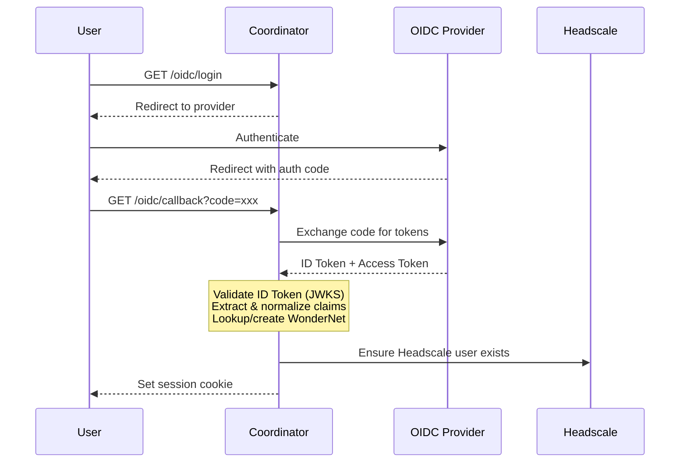
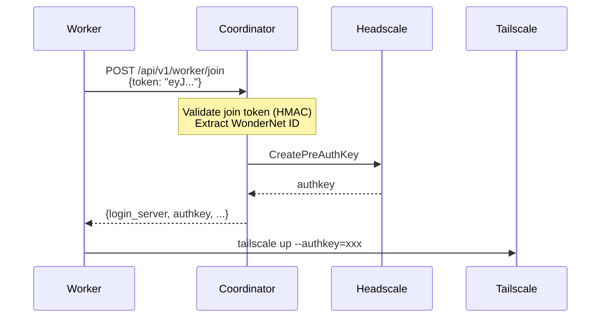
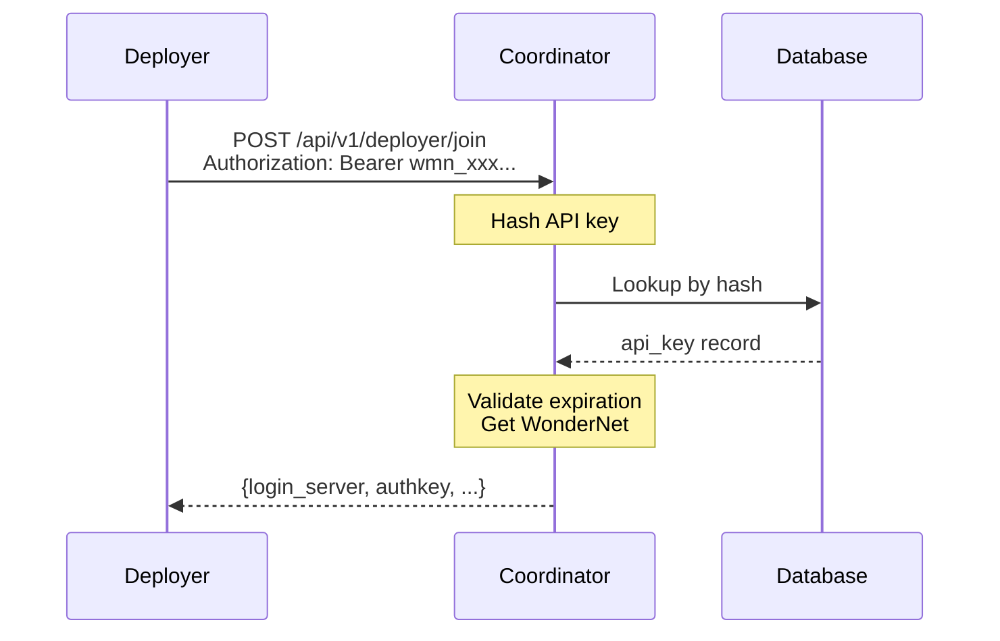

# Wonder Mesh Net - Authentication Design

## Overview

This document describes the authentication architecture for Wonder Mesh Net.

**Design Goal**: Enable users to authenticate via multiple identity providers (GitHub, Google, etc.) while keeping Coordinator simple.

**Key Principle**:
1. **Coordinator only talks to Keycloak** - Single OIDC integration point
2. **Keycloak handles multi-provider** - Identity Brokering for GitHub, Google, etc.
3. **Headscale is fully managed by Coordinator** - Coordinator provisions Headscale users, PreAuthKeys, and ACL policies via gRPC API. Headscale has no OIDC.

---

## Architecture Overview



---

## Authentication Mechanisms

Wonder Mesh Net uses three distinct authentication mechanisms:

| Mechanism | Issuer | Algorithm | TTL | Purpose |
|-----------|--------|-----------|-----|---------|
| **OIDC JWT** | External Provider | RSA/ECDSA (JWKS) | 5-60 min | User session authentication |
| **Join Token** | Coordinator | HMAC-SHA256 | 1-24 hr | Worker node bootstrap |
| **API Key** | Coordinator | SHA256 hash | Configurable | Third-party integrations |

### OIDC JWT (User Sessions)

External identity providers (Keycloak, GitHub) issue JWTs after user authentication. Coordinator validates these tokens and establishes user sessions.

### Join Token (Worker Bootstrap)

Short-lived, self-contained tokens for worker nodes to join a WonderNet. Contains coordinator URL and WonderNet ID. Workers exchange these for Headscale PreAuthKeys.

- **Stateless**: No database storage required; validated via HMAC signature
- **Reusable**: Can be used multiple times within TTL (e.g., join multiple workers)
- **Default TTL**: 8 hours

### API Key (Third-party Access)

Long-lived credentials for programmatic access. Stored as SHA256 hashes. Used by third-party integrations (PaaS platforms, automation tools, etc.) to access WonderNet resources.

---

## Keycloak Identity Brokering

### How It Works

When a user clicks "Login with [External IdP]":



### Key Point: Coordinator Sees Only Keycloak JWT

No matter which external IdP the user authenticates with, Coordinator always receives a **Keycloak JWT**. The JWT contains:

```json
{
  "sub": "keycloak-user-uuid",
  "preferred_username": "alice",
  "email": "alice@example.com",
  "name": "Alice",
  "iss": "https://auth.example.com/realms/wonder-mesh",
  "aud": "coordinator",
  "exp": 1704067200,
  "iat": 1704063600
}
```

### Identity Provider Information in JWT

Keycloak can include the original IdP in custom claims (configured via protocol mappers):

```json
{
  "sub": "keycloak-user-uuid",
  "identity_provider": "github",
  "identity_provider_identity": "github-user-id",
  ...
}
```

This allows Coordinator to know which external IdP was used, if needed.

### Keycloak Configuration for Identity Brokering

In Keycloak Admin Console:

1. **Add Identity Provider**
   - Type: OpenID Connect v1.0 (or OAuth 2.0 for social logins)
   - Alias: e.g., `github`, `google`, or custom IdP name
   - Authorization URL: IdP's authorization endpoint
   - Token URL: IdP's token endpoint
   - Client ID: (from IdP)
   - Client Secret: (from IdP)

2. **Configure Mappers** (optional)
   - Add `identity_provider` claim to tokens
   - Map external user attributes to Keycloak user

3. **First Login Flow**
   - Auto-create user on first login
   - Or link to existing user by email

---

## Identity Model

### Current: 1:1 Keycloak User to WonderNet Mapping



**Key insight**: Keycloak manages identity linking. If a user logs in via GitHub today and Google tomorrow, Keycloak can link them to the same Keycloak user (via email or explicit linking). Coordinator only sees one stable `sub` claim.

---

## Authentication Flows

### User Perspective: Adding a Worker to Mesh



---

### Flow 1: User Login via OIDC Provider



### Flow 2: Worker Node Join



### Flow 3: API Key Authentication



---

## Endpoint Authentication Matrix

| Endpoint | JWT Session | API Key | None | Notes |
|----------|:-----------:|:-------:|:----:|-------|
| `GET /oidc/login` | - | - | ✅ | Start OIDC flow |
| `GET /oidc/callback` | - | - | ✅ | OIDC callback |
| `POST /api/v1/join-token` | ✅ | ❌ | - | Privileged: generate join token |
| `POST /api/v1/authkey` | ✅ | ❌ | - | Privileged: direct authkey |
| `GET /api/v1/api-keys` | ✅ | ❌ | - | Privileged: list API keys |
| `POST /api/v1/api-keys` | ✅ | ❌ | - | Privileged: create API key |
| `DELETE /api/v1/api-keys/{id}` | ✅ | ❌ | - | Privileged: delete API key |
| `GET /api/v1/nodes` | ✅ | ✅ | - | Read-only |
| `POST /api/v1/deployer/join` | ❌ | ✅ | - | Third-party integration |
| `POST /api/v1/worker/join` | - | - | ✅ | Validates join token internally |
| `GET /coordinator/health` | - | - | ✅ | Health check |

**Security Principle**: API keys cannot call privileged endpoints to prevent privilege escalation.

---

## Headscale Authentication Model

Headscale (the control plane) has its own authentication model, which is fully managed by Coordinator in Wonder Mesh Net.

### Headscale Native Auth Mechanisms

| Mechanism | Purpose | How It Works |
|-----------|---------|--------------|
| **API Key** | Administrative access | Static key for gRPC/REST API calls |
| **PreAuthKey** | Node registration | One-time or reusable key for `tailscale up --authkey` |
| **OIDC** | Interactive login | Browser-based auth (disabled in our setup) |

### PreAuthKey Deep Dive

PreAuthKeys are the primary mechanism for nodes to join the mesh:

```bash
# CLI generation (standalone Headscale)
headscale preauthkeys create --user <namespace> --expiration 1h --reusable

# What Coordinator does via gRPC
CreatePreAuthKey(user, expiration, reusable, ephemeral)
```

**PreAuthKey Properties:**

| Property | Description |
|----------|-------------|
| `user` | Namespace the node joins |
| `expiration` | When the key becomes invalid |
| `reusable` | Can register multiple nodes |
| `ephemeral` | Node auto-deleted when offline |

---

## Realm Isolation

### Headscale User = Network Namespace

Each WonderNet maps to exactly one Headscale "user" (namespace). Nodes within a user can communicate; nodes across users cannot (unless ACL permits).

### ACL Policy Structure

```json
{
  "acls": [
    {
      "action": "accept",
      "src": ["550e8400-e29b-41d4-a716-446655440000@"],
      "dst": ["550e8400-e29b-41d4-a716-446655440000@:*"]
    },
    {
      "action": "accept",
      "src": ["660f9511-f30c-52e5-b827-557766551111@"],
      "dst": ["660f9511-f30c-52e5-b827-557766551111@:*"]
    }
  ]
}
```

Each rule allows nodes within the same namespace to communicate. Cross-namespace communication is denied by default.

### ACL Management

When a new WonderNet is created:
1. Coordinator creates Headscale user (UUID)
2. Coordinator adds ACL rule for the new user
3. ACL policy is atomically updated via gRPC

---

## Security Considerations

### Token Security

| Token Type | Storage | Transmission | Revocation |
|------------|---------|--------------|------------|
| OIDC JWT | Not stored | HTTPS, short-lived | Provider-controlled |
| Join Token | Not stored | Out-of-band (copy-paste) | TTL expiration |
| API Key | SHA256 hash only | HTTPS | Explicit deletion |

### API Key Best Practices

- Keys shown only once at creation (cannot be retrieved later)
- Constant-time hash comparison to prevent timing attacks
- Optional expiration for time-limited access
- `last_used_at` tracking for audit

### JWKS Security

- JWKS cached with automatic refresh (5-minute interval)
- Signature verification using provider's public keys
- Issuer and audience validation

---

## Configuration

### Coordinator Environment Variables

```bash
# Keycloak OIDC Configuration (single provider)
KEYCLOAK_URL=https://auth.example.com
KEYCLOAK_REALM=wonder-mesh
KEYCLOAK_CLIENT_ID=coordinator
KEYCLOAK_CLIENT_SECRET=xxx

# JWT Secret for Join Tokens (internal, not OIDC)
JWT_SECRET=xxx

# Headscale Connection
HEADSCALE_URL=http://localhost:8080
HEADSCALE_API_KEY=xxx
```

### Keycloak Realm Configuration

The Keycloak realm should be configured with:

1. **Client for Coordinator**
   - Client ID: `coordinator`
   - Access Type: confidential
   - Valid Redirect URIs: `https://coordinator.example.com/oidc/callback`

2. **Identity Providers** (for multi-provider support)
   - Any OIDC-compliant IdP
   - Social logins (GitHub, Google, etc.)
   - Enterprise IdPs (Okta, Azure AD, etc.)

3. **Protocol Mappers** (optional, for debugging)
   - `identity_provider` - which IdP was used
   - `identity_provider_identity` - external user ID

